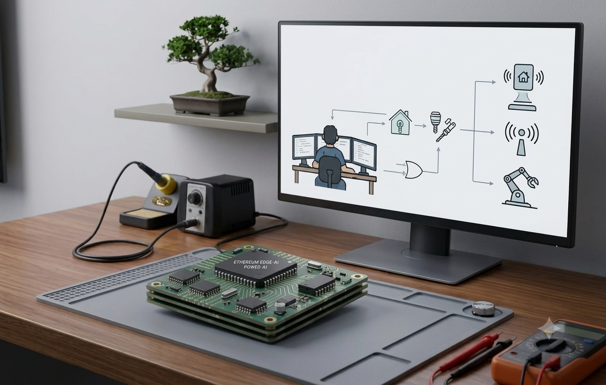

# Hi ⚡, I'm B Suresh Kumar
### Embedded Edge AI, VLSI & Firmware Engineer 🛠️

Accomplished Embedded Developer with an M.Tech in Embedded Systems & VLSI Design. I specialize in bridging the gap between cutting-edge AI research and scalable hardware solutions, focusing on edge computing, multi-layered PCB design, digital system design (VLSI), and robust low-power IoT architectures.

---

### 🚀 What I Do
- 🧠 **Embedded Edge AI:** Deploying intelligence directly onto microcontrollers and resource-constrained hardware.
- 🎛️ **VLSI & Digital Design:** Designing, modeling, and verifying digital systems using hardware description languages (Verilog/System Verilog).
- ⚡ **Power Management:** Expert in Energy Harvesting techniques and Battery Management Systems (BMS).
- 🤖 **Robotics & IoT:** Designing high-performance electronic control systems for robotic platforms and autonomous hardware.

---

### 🛠️ Tech Stack & Skills

| Category | Tools & Technologies |
| :--- | :--- |
| **Languages** | Embedded C/C++, Python, MATLAB, Verilog, System Verilog, SQL |
| **VLSI & Digital Design** | FPGA Prototyping, RTL Coding, Xilinx (XSG) Integration, FSM Design |
| **Hardware & Architectures** | ATMEGA328P, ESP32, STM32, RTOS |
| **PCB & Hardware Design** | Schematic Capture, Gerber File Generation, BMS Integration |
| **Domain Expertise** | Edge AI Model Deployment, Energy Harvesting, Automated Logging |

---

### 📁 Featured Projects

- **UART Controller using Verilog**
  Designed and implemented a universal asynchronous receiver-transmitter (UART) controller in Verilog to achieve reliable and structured hardware-level serial data communication.

- **Vending Machine Control Unit (Verilog)**
  Developed an optimized Finite State Machine (FSM) based vending machine controller utilizing Verilog HDL to efficiently handle transaction logic, coin validation, and product dispensing.

- **4-bit Counter (Verilog)**
  Implemented a robust synchronous/asynchronous 4-bit digital counter in Verilog to demonstrate core concepts of sequential circuit design and simulation.

- **VLSI & FPGA Image Processing**
  Worked on high-performance image enhancement systems by importing Xilinx System Generator (XSG) properties into FPGA boards, bridging algorithmic software logic with hardware implementation.

- **HEXA_AI_IoT & BMS Design**
  Engineered full-cycle PCB development and hardware architectures for edge AI robotics, including custom on-board Battery Management Systems for autonomous power control.
  
- **Robotic Arm & Drone Systems**
  Developed custom ESP32-based aerial platforms and control electronics for multi-axis robotic arms, ensuring high stability and hardware-software synchronization.
  
- **Energy Harvesting Circuits**
  Designed highly efficient power management solutions to maximize the operational lifespan of hybrid IoT and low-power embedded devices.

---

### 📊 Research & Publications
I have published several papers focusing on *Energy-Aware Information Exchange*, *Dynamic Power Control for IoT*, and *FPGA-based System Design*. Feel free to reach out if you'd like to collaborate on academic R&D or hardware-software co-design!

---

### 🤝 Connect with Me
- 📧 **Email:** sureshbkumar035@gmail.com
- 💼 **LinkedIn:** www.linkedin.com/in/suresh-kumar-balija-00116b259

"Optimizing microcontrollers and architecting high-quality edge computing platforms."
